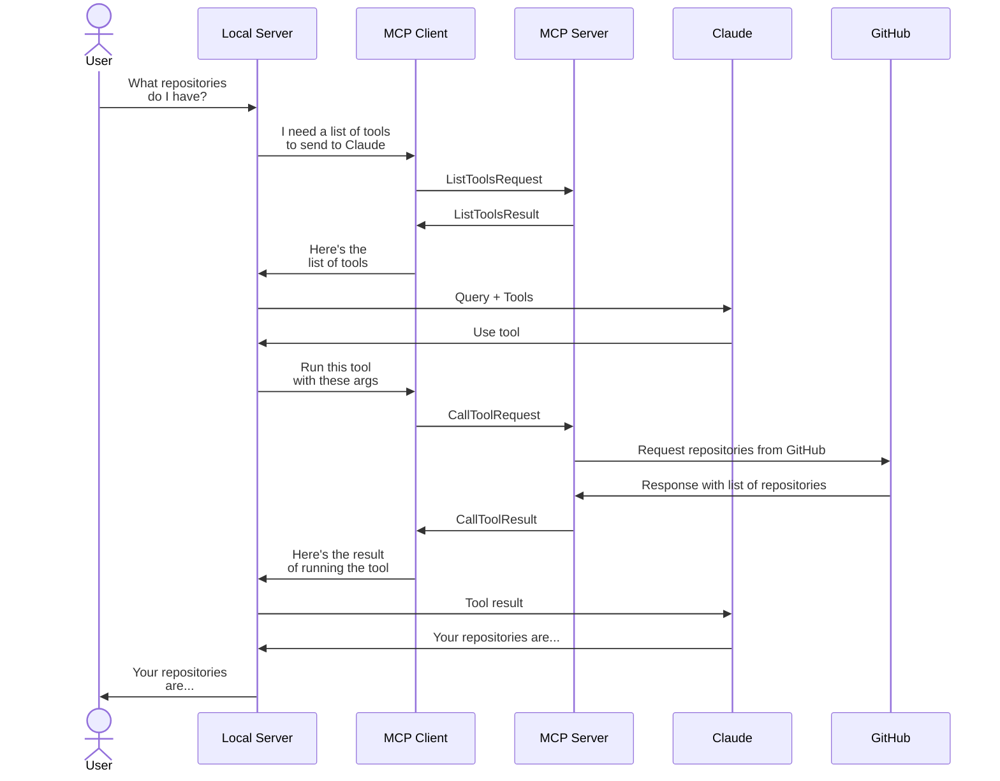
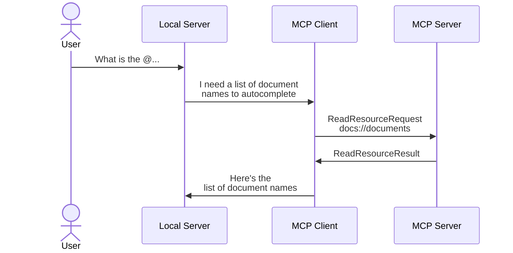

# Introduction to Model Context Protocol

Code and notes from the [Introduction to Model Context Protocol](https://www.coursera.org/learn/introduction-to-model-context-protocol)
course on Coursera.

This course covers the **Model Context Protocol (MCP)**, an open protocol that
standardizes how applications provide context to Large Language Models (LLMs).
MCP enables secure, two-way connections between data sources and AI-powered
tools.

## Table of Contents

- [Module 01: Introduction](#module-01-introduction)
- [Module 02: Hands-on with MCP Servers](#module-02-hands-on-with-mcp-servers)
- [Module 03: Connecting with MCP Clients](#module-03-connecting-with-mcp-clients)
- [Module 04: Assessment and Wrap Up](#module-04-assessment-and-wrap-up)

---

## Module 01: Introduction

- MCP serves as a **communication layer** that connects AI to services.
- It consists of two main components: the client and the server, where the
  server contains tools, resources, and prompts.
- The client serves as the access point for tools implemented by the MCP
  server, allowing for communication over various protocols like HTTP or
  WebSockets.

---

## Module 02: Hands-on with MCP Servers

- Creating an MCP Server is easy: `mcp = FastMCP()`.
- To add a tool to the server, we use `@mcp.tool(name="...", description="...")`.
- The schema is inferred from the function signature, so we use type hints and
  leverage Pydantic's `Field` to add metadata.
- By running `mcp dev <server>` we can start the MCP Inspector, which allows
  us to interact with the server (connect to it, list tools, run tools, etc).
- The MCP Inspector maintains server state, so it’s kept between tool calls.

---

## Module 03: Connecting with MCP Clients

- To add a resource to the server, we use `@mcp.resource(uri="...")`. It's a
  good practice to also include the `mime_type`.
- There are two types of resources: **static** and **templated**. Static
  resources have a fixed URI, while templated resources have URI with
  variables.

> [!TIP]
> Resource content is included in the initial prompt, avoiding the need for
> additional tool calls.

- Prompts allow users to use slash commands.
- Prompts are tailored for specific tasks and allow users to access
  pre-defined prompts without needing to create them from scratch.

---

## Module 04: Assessment and Wrap Up

- Tools, resources, and prompts are "controlled" by different parties:
  - Tools are **model** controlled.
  - Resources are **app** controlled.
  - Prompts are **user** controlled.

---

## Next Steps

- [Model Context Protocol](https://modelcontextprotocol.io)
- [Model Context Protocol: Advanced Topics](https://www.coursera.org/learn/model-context-protocol-advanced-topics)
