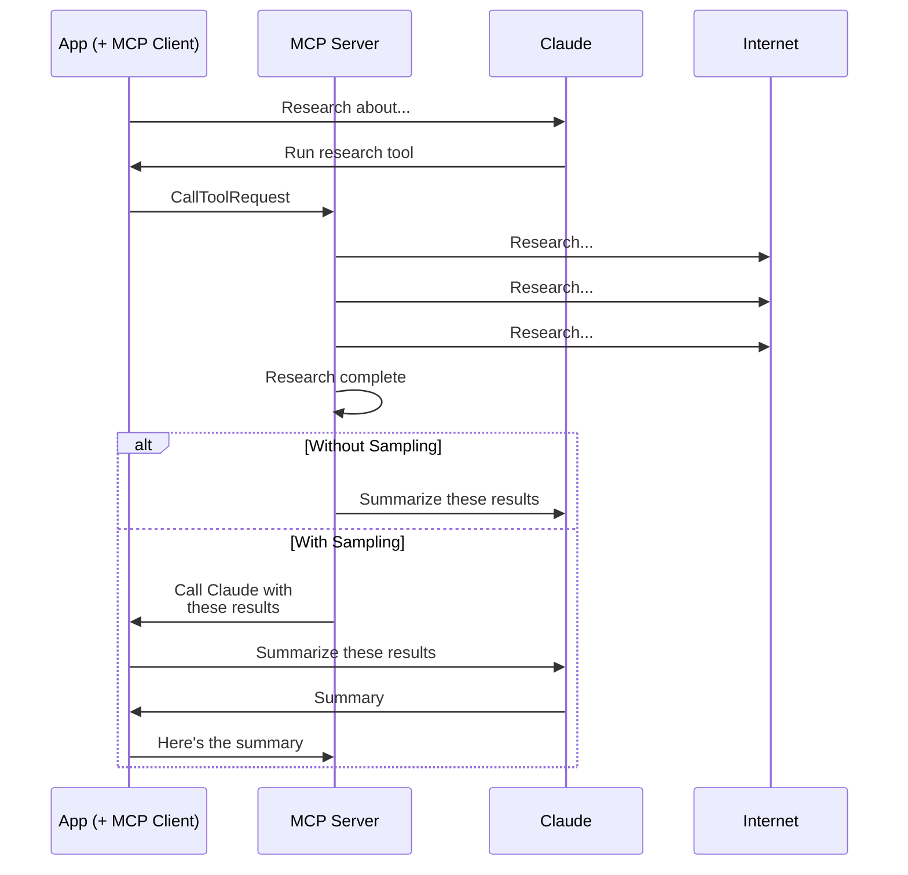
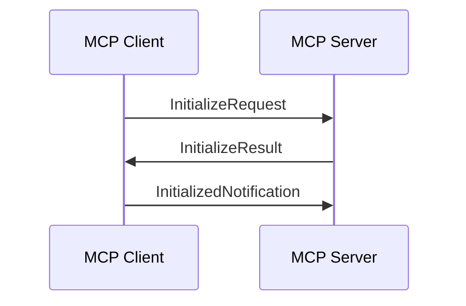

# Model Context Protocol: Advanced Topics

Code and notes from the [Model Context Protocol: Advanced Topics](https://www.coursera.org/learn/model-context-protocol-advanced-topics)
course on Coursera.

This course builds on the foundational concepts of MCP, teaching
production-ready features for building MCP servers and clients. Topics include
sampling (shifting AI model costs to clients), real-time logging and progress
notifications, roots(MCP's permission system for secure file discovery),
bidirectional communication patterns, and transport methods (STDIO vs
StreamableHTTP).

## Table of Contents

- [Module 01: Core MCP Features](#module-01-core-mcp-features)
- [Module 02: Transports and Communication](#module-02-transports-and-communication)
- [Module 03: Assessment and Next Steps](#module-03-assessment-and-next-steps)

---

## Module 01: Core MCP Features

Sampling delegates LLM calls from the MCP server to the MCP client:
- Particularly useful for public MCP servers to prevent API keys storage and
  management, which in turn helps with security. Costs are also shifted to the
  client.
- Reduces complexity on the server.
- Requires sampling callback to be implemented on the client.
- One trade-off is that the increased hop count may result in increased
  latency.

Notifications allow clients to receive messages from the server:
- Can be used to provide feedback to users, greatly increasing UX.

Roots allow users to grant servers access to specific files and folders, like
a permission system:
- They help prevent LLMs navigating the entire file system.
- The MCP server must implement checks to ensure only authorized files are
  accessed.

---

## Module 02: Transports and Communication

Clients and servers communicate using JSON messages:
- All message types are available at
  https://github.com/modelcontextprotocol/modelcontextprotocol/blob/main/schema/draft/schema.ts.
- Messages are divided into request-result pairs and notification messages
  that do not require a response.

A communication is initialized with a handshake that includes three messages:
`InitializeRequest`, `InitializeResult`, and `InitializedNotification`.

The communication between clients and servers happens over a transport layer:
- The `stdio` transport can only be used if the client and server are running
  on the same machine.
- On `stdio`, clients write to `stdin` and servers send messages to `stdout`.
  Both the client and the server can initiate a message exchange.

When the server is running on a different machine, the `StreamableHTTP` is
used:
- It allows clients to connect to the server over `HTTP`.
- The server can't initiate a message exchange anymore, which means
  notification messages can't be sent (such as logging and progress updates).
- With `StreamableHTTP`, both the `InitializeResponse` and the
  `InitializedNotification` (and all following messages) have a
  `mcp-session-id` header.
- There's a workaround that allows servers to send notifications to clients
  over `HTTP` using a separate, long-lived connection (SSE). To do that, the
  client must send a `GET` request to the server to open the channel.
- When the client makes a request to the server, a new SSE connection is
  created. All messages related to that request are sent over that channel,
  and it's automatically closed after the result is sent.
  - Messages like `ProgressNotification` are **NOT** sent over the new
    channel but the separate one.
- Activating the flag `stateless_http`, prevents the creation of a session ID,
  and disables server-initiated messages and sampling.
  - Stateless mode is used, for example, when horizontal scaling is needed. In
    this case, the load balancer should be configured with sticky sessions.
- Activating the flag `json_response`, disables streaming and sends the entire
  response in a single, final, JSON message.

---

## Module 03: Assessment and Next Steps

N/A.

---

## Next Steps

- [Model Context Protocol](https://modelcontextprotocol.io)
